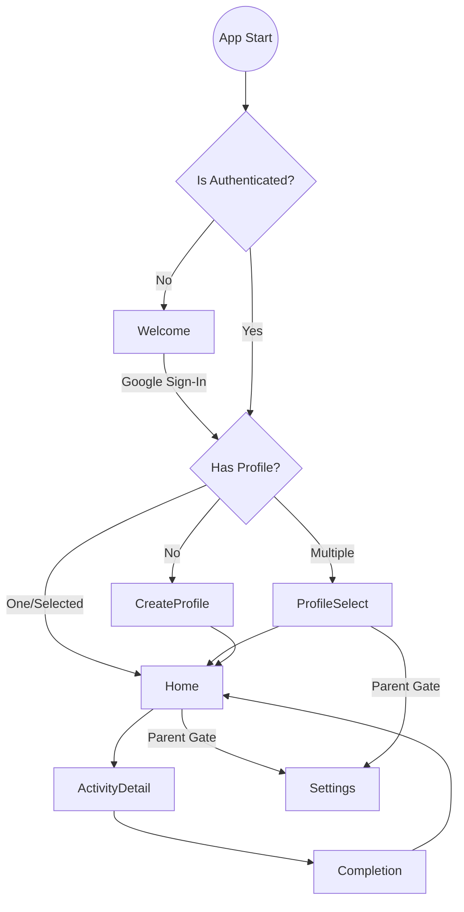

# Mobile App Architecture: Tigoo MVP

## 1. Screen List

### Onboarding & Support
*   **Splash Screen**: Branding loader.
*   **Welcome / Auth Landing**: Entry point offering Login or Sign Up.
*   **Terms & Privacy**: Legal text display (Webview or text).

### Authentication (Google Only)
*   **Welcome / Google Sign-In**: Entry point handling Google OAuth.

### Profile Management
*   **Profile Selection**: Grid of child profiles (if multiple allowed) or Auto-route.
*   **Create/Edit Profile**: Child name, avatar selection, age (for content filtering).

### Core Experience (Child Level)
*   **Home (Dashboard)**: Main navigation hub. Category/Activity selection.
*   **Activity Detail/Player**: The core interaction screen (Game/Lesson/Video).
*   **Completion/Reward**: Feedback screen after activity.

### Settings / Parent Zone
*   **Parent Gate**: Simple math challenge or biometric check to enter.
*   **Settings Dashboard**: Subscription management, Account info, Profile management link.

---

## 2. Navigation Map

**Flow:** `Auth` -> `Profile` -> `Home`

**Routing Rules:**
1.  **Cold Start**: Check Local Storage for valid `auth_token`.
    *   *False* -> Go to `Welcome`.
    *   *True* -> Check `current_profile_id`.
2.  **Auth State**:
    *   On `Logout` -> Clear all tokens, navigate to `Welcome` (reset stack).
3.  **Profile & Sub State**:
    *   If `auth_token` valid:
        *   **Subscription Check**: If `status` == 'expired' -> BLOCK -> Go to `Paywall/Settings`.
        *   Else:
            *   No `profiles` -> Go to `CreateProfile`.
            *   Multiple `profiles` / No selection -> Go to `ProfileSelect`.
            *   Profile Selected -> Go to `Home`.

---

## 3. Data Flow Notes

### Global State
*   **AuthContext**: User ID, Token, Subscription Status.
*   **ProfileContext**: Current Child ID, Name, Avatar, Progress/Level.

### Screen-Specific Needs

| Screen | Input / Params | Data Needed | Action |
| :--- | :--- | :--- | :--- |
| **Splash** | None | LocalStorage (Token, Profile) | Determine Initial Route |
| **Login** | Email/Pass | Auth API | Store Token, Fetch Profiles |
| **Profile Select**| None | List of Profiles | Select Profile (Set Context) |
| **Home** | Profile ID | Activities List (filtered by Age/Level) | Navigate to Activity |
| **Activity** | Activity ID | Activity Content/Assets | Send Progress/Score |
| **Settings** | User ID | Account Details, Sub status | Update User/Sub |

---

## 4. Implementation Tasks for Orchestrator

**Phase 1: Foundation**
1.  [ ] Initialize React Native / Flutter project structure.
2.  [ ] Set up Navigation container (e.g., React Navigation or GoRouter).
3.  [ ] Implement Authentication State Management (Provider/Bloc).
4.  [ ] Create `LocalStorage` service for persisting tokens.

**Phase 2: Auth & Profiles**
5.  [ ] Build `WelcomeScreen` with Google Sign-In integration.
6.  [ ] Build `ProfileSelection` and `CreateProfile` screens.
7.  [ ] Implement "Auth Guard" and "Subscription Guard" (Hard Block) routing logic.

**Phase 3: Core UI**
8.  [ ] Build `HomeScreen` with dummy data list.
9.  [ ] Build `ActivityDetail` placeholder screen.
10. [ ] Build `ParentGate` mechanism for Settings access.
